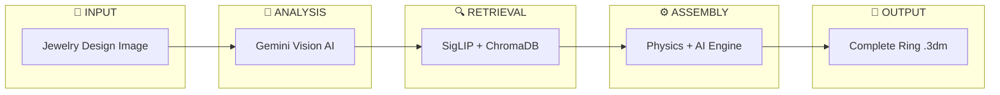
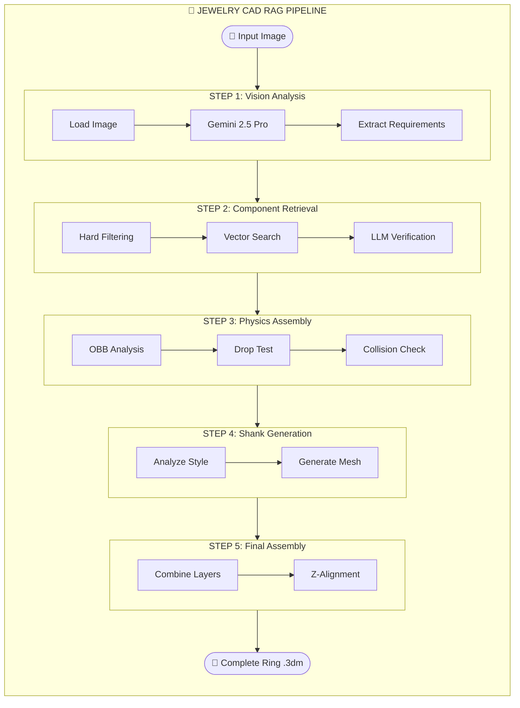
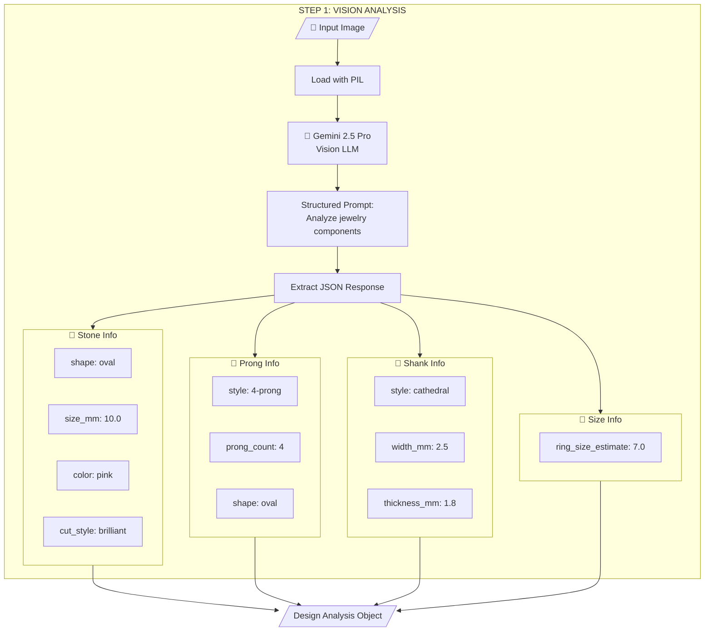
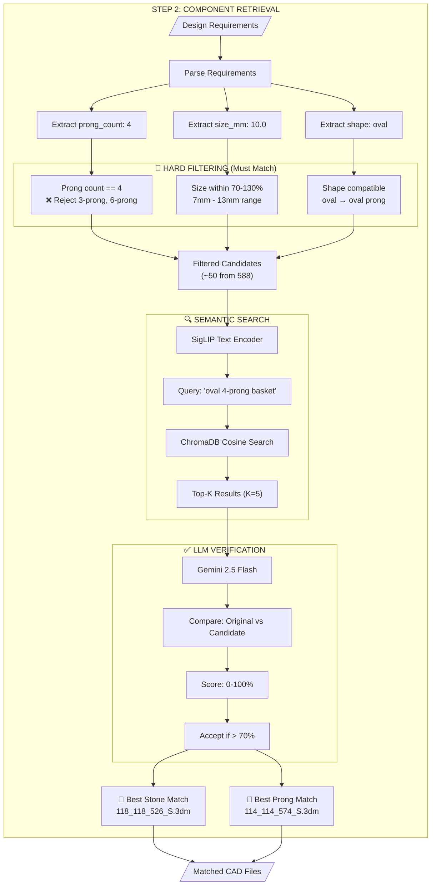
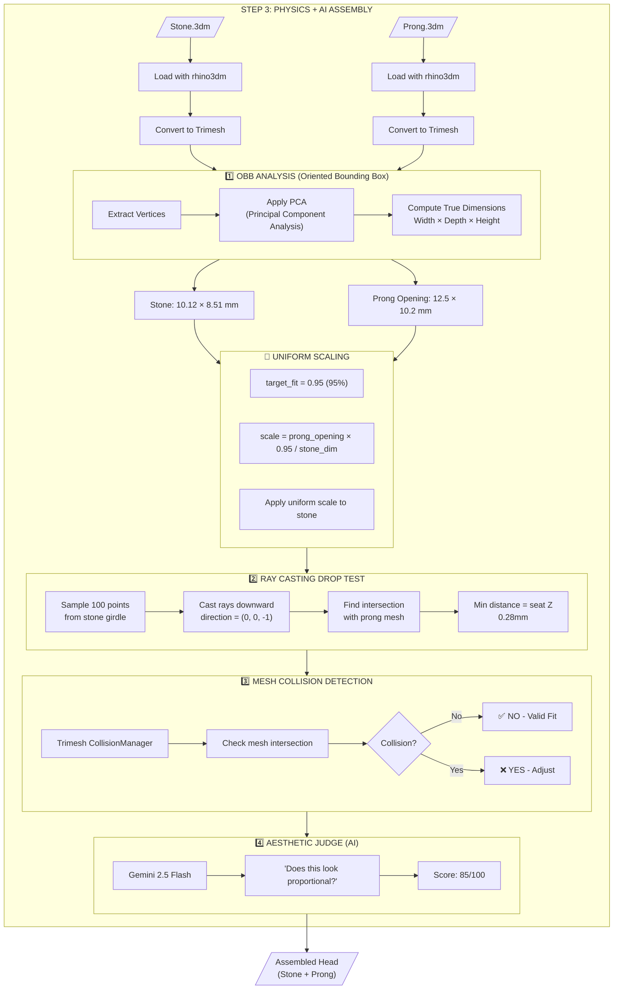
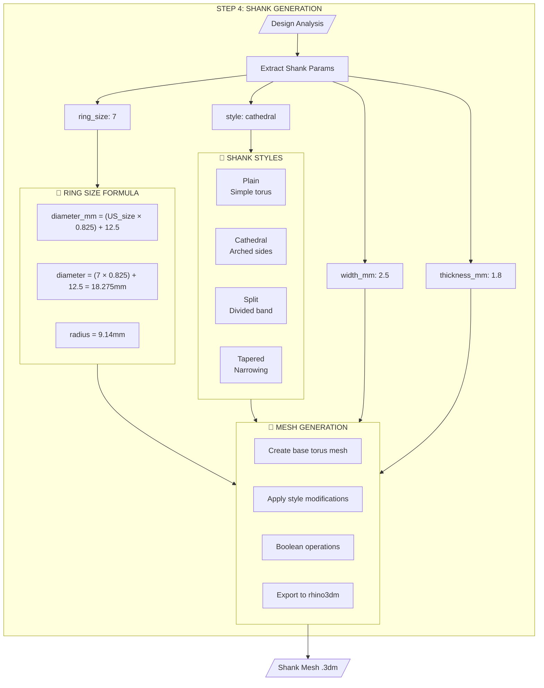
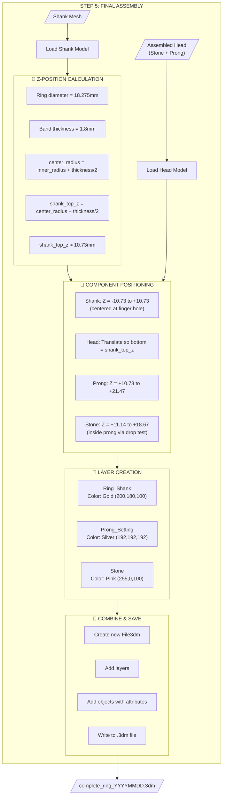
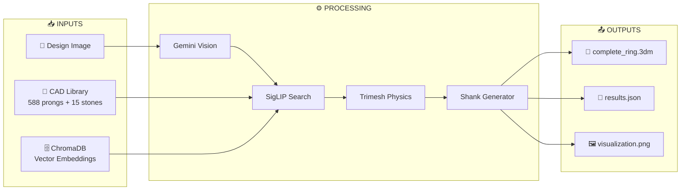
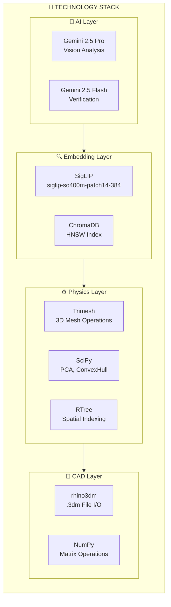
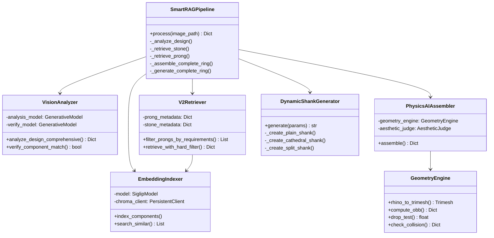

# 💎 Jewelry CAD RAG Agent

> **Multi-modal RAG (Retrieval-Augmented Generation) system for jewelry CAD component retrieval and intelligent assembly.**

An AI-powered pipeline that takes a jewelry design image and automatically produces a complete, manufacturable CAD file (`.3dm`) by:
1. Analyzing the design with Vision AI (Gemini)
2. Retrieving matching CAD components using SigLIP embeddings
3. Assembling components with Physics + AI hybrid system
4. Generating a parametric shank based on design analysis

---

## 📑 Table of Contents

- [System Overview](#-system-overview)
- [Mermaid Pipeline Diagrams](#-mermaid-pipeline-diagrams)
- [Complete Pipeline Flowchart](#-complete-pipeline-flowchart)
- [File Structure & Module Descriptions](#-file-structure--module-descriptions)
- [Core Modules Deep Dive](#-core-modules-deep-dive)
- [Assembly System Architecture](#-assembly-system-architecture)
- [Quick Start](#-quick-start)
- [Commands Reference](#-commands-reference)
- [Technology Stack](#-technology-stack)
- [Configuration](#-configuration)

---

## 🔄 System Overview

### High-Level Architecture



### Two Operational Modes

| Mode | Description | When to Use |
|------|-------------|-------------|
| **Offline Preprocessing** | Index CAD files, generate embeddings, create metadata | Run once per library update |
| **Online Processing** | Analyze image → Retrieve → Assemble | Run per design request |

---

## 📊 Mermaid Pipeline Diagrams

### 🔷 Master Pipeline Overview



---

### 📍 STEP 1: Vision Analysis (Detailed)



**Key File:** `vision_analyzer.py` → `VisionAnalyzer.analyze_design_comprehensive()`

---

### 📍 STEP 2: Component Retrieval (Detailed)



**Key Files:** 
- `v2_retriever.py` → Hard filtering
- `embedding_indexer.py` → SigLIP + ChromaDB
- `vision_analyzer.py` → LLM verification

---

### 📍 STEP 3: Physics + AI Assembly (Detailed)



**Key File:** `smart_assembly_physics.py`
- `GeometryEngine.compute_obb()` - OBB via PCA
- `GeometryEngine.drop_test()` - Ray casting
- `GeometryEngine.check_collision()` - Mesh intersection
- `AestheticJudge` - AI style check

---

### 📍 STEP 4: Shank Generation (Detailed)



**Key File:** `dynamic_shank_generator.py` → `DynamicShankGenerator.generate()`

---

### 📍 STEP 5: Final Assembly (Detailed)



**Key File:** `smart_pipeline.py` → `SmartRAGPipeline._generate_complete_ring()`

---

### 🔷 Data Flow Diagram



---

### 🔷 Technology Stack Diagram



---

### 🔷 Class Relationship Diagram



---

## 📊 Complete Pipeline Flowchart

### Stage 1: Offline Preprocessing (Run Once)

```
┌─────────────────────────────────────────────────────────────────────────────────────┐
│                           OFFLINE PREPROCESSING PIPELINE                            │
├─────────────────────────────────────────────────────────────────────────────────────┤
│                                                                                     │
│   ┌──────────────────┐                                                              │
│   │  CAD Files (.3dm)│                                                              │
│   │  ────────────────│                                                              │
│   │  cad_library/    │                                                              │
│   │  ├── prongs/     │  588 prong components                                        │
│   │  └── stones/     │  15 stone components                                         │
│   └────────┬─────────┘                                                              │
│            │                                                                        │
│            ▼                                                                        │
│   ┌──────────────────┐         ┌──────────────────┐         ┌──────────────────┐   │
│   │  Rhino Screenshots│         │  Multi-View      │         │  LLM Metadata    │   │
│   │  (rhino_plugins/) │  ───►  │  Renders         │  ───►  │  (Gemini)        │   │
│   │  Generate .jpg    │         │  prongs_multiview│         │  Analyze each    │   │
│   │  from CAD files   │         │  stones_multiview│         │  component       │   │
│   └──────────────────┘         └────────┬─────────┘         └────────┬─────────┘   │
│                                         │                            │              │
│                                         ▼                            ▼              │
│                               ┌──────────────────┐         ┌──────────────────┐    │
│                               │  SigLIP Embeddings│         │  Metadata JSON   │    │
│                               │  (1152-dim vectors)│         │  prongs_metadata │    │
│                               │  embedding_indexer │         │  _v2.json        │    │
│                               └────────┬─────────┘         └────────┬─────────┘    │
│                                         │                            │              │
│                                         ▼                            ▼              │
│                               ┌─────────────────────────────────────────────────┐   │
│                               │              ChromaDB Vector Database           │   │
│                               │  ─────────────────────────────────────────────  │   │
│                               │  • Image embeddings (SigLIP 1152-dim)           │   │
│                               │  • Text metadata (prong count, shape, etc.)     │   │
│                               │  • Persistent storage in vector_stores/         │   │
│                               └─────────────────────────────────────────────────┘   │
│                                                                                     │
└─────────────────────────────────────────────────────────────────────────────────────┘
```

### Stage 2: Online Processing (Per Query)

```
┌─────────────────────────────────────────────────────────────────────────────────────┐
│                              STEP 1: DESIGN ANALYSIS                                │
│                              (vision_analyzer.py)                                   │
├─────────────────────────────────────────────────────────────────────────────────────┤
│                                                                                     │
│   ┌──────────────────┐                          ┌──────────────────────────────┐   │
│   │                  │                          │  Extracted Requirements      │   │
│   │  📸 Reference    │      Gemini 2.5 Pro      │  ──────────────────────────  │   │
│   │     Image        │  ─────────────────────►  │  STONE:                      │   │
│   │                  │       (Vision LLM)       │  • shape: "oval"             │   │
│   │  [User's ring    │                          │  • size_mm: 10.0             │   │
│   │   design photo]  │                          │  • color: "pink"             │   │
│   │                  │                          │                              │   │
│   │                  │                          │  PRONG:                      │   │
│   │                  │                          │  • style: "4-prong"          │   │
│   │                  │                          │  • prong_count: 4            │   │
│   │                  │                          │                              │   │
│   │                  │                          │  SHANK:                      │   │
│   │                  │                          │  • style: "cathedral"        │   │
│   │                  │                          │  • width_mm: 2.5             │   │
│   └──────────────────┘                          └──────────────────────────────┘   │
│                                                                                     │
└─────────────────────────────────────────────────────────────────────────────────────┘
                                         │
                                         ▼
┌─────────────────────────────────────────────────────────────────────────────────────┐
│                              STEP 2: COMPONENT RETRIEVAL                            │
│                              (v2_retriever.py + embedding_indexer.py)               │
├─────────────────────────────────────────────────────────────────────────────────────┤
│                                                                                     │
│   ┌──────────────────┐                                                              │
│   │  Requirements    │                                                              │
│   │  from Step 1     │                                                              │
│   └────────┬─────────┘                                                              │
│            │                                                                        │
│            ▼                                                                        │
│   ┌──────────────────┐         ┌──────────────────┐         ┌──────────────────┐   │
│   │  HARD FILTERING  │         │  SEMANTIC SEARCH │         │  LLM VERIFICATION│   │
│   │  ────────────────│   ───►  │  ────────────────│   ───►  │  ────────────────│   │
│   │  • Prong count   │         │  • SigLIP encode │         │  Gemini Flash    │   │
│   │    MUST match    │         │    query text    │         │  compares:       │   │
│   │  • Size range    │         │  • ChromaDB      │         │  • Original img  │   │
│   │    70-130%       │         │    cosine search │         │  • Candidate img │   │
│   │  • Shape compat  │         │  • Top-K results │         │  → Yes/No match  │   │
│   └──────────────────┘         └──────────────────┘         └──────────────────┘   │
│                                                                      │              │
│                                                                      ▼              │
│                                                        ┌──────────────────────┐    │
│                                                        │  MATCHED COMPONENTS  │    │
│                                                        │  ────────────────────│    │
│                                                        │  📄 Stone: 118_xxx.3dm│   │
│                                                        │  📄 Prong: 114_xxx.3dm│   │
│                                                        │  🎯 Confidence: 95%   │   │
│                                                        └──────────────────────┘    │
│                                                                                     │
└─────────────────────────────────────────────────────────────────────────────────────┘
                                         │
                                         ▼
┌─────────────────────────────────────────────────────────────────────────────────────┐
│                              STEP 3: PHYSICS + AI ASSEMBLY                          │
│                              (smart_assembly_physics.py)                            │
├─────────────────────────────────────────────────────────────────────────────────────┤
│                                                                                     │
│   ┌──────────────────────────────────────────────────────────────────────────────┐ │
│   │                        GEOMETRY ENGINE (Trimesh)                             │ │
│   │  ────────────────────────────────────────────────────────────────────────── │ │
│   │                                                                              │ │
│   │  ┌─────────────────┐    ┌─────────────────┐    ┌─────────────────┐          │ │
│   │  │ 1. OBB Analysis │    │ 2. DROP TEST    │    │ 3. COLLISION    │          │ │
│   │  │ ───────────────│    │ ───────────────│    │ ───────────────│          │ │
│   │  │ Oriented       │    │ Ray casting    │    │ Mesh-to-mesh   │          │ │
│   │  │ Bounding Box   │────►│ simulates      │────►│ intersection   │          │ │
│   │  │ via PCA        │    │ gravity drop   │    │ detection      │          │ │
│   │  │                │    │                │    │                │          │ │
│   │  │ Result:        │    │ Result:        │    │ Result:        │          │ │
│   │  │ TRUE dimensions│    │ EXACT Z-height │    │ YES/NO fit     │          │ │
│   │  │ (rotation-     │    │ for seating    │    │                │          │ │
│   │  │  invariant)    │    │                │    │                │          │ │
│   │  └─────────────────┘    └─────────────────┘    └─────────────────┘          │ │
│   │                                                                              │ │
│   └──────────────────────────────────────────────────────────────────────────────┘ │
│                                         │                                          │
│                                         ▼                                          │
│   ┌──────────────────────────────────────────────────────────────────────────────┐ │
│   │                        AESTHETIC JUDGE (Gemini AI)                           │ │
│   │  ────────────────────────────────────────────────────────────────────────── │ │
│   │  AI ONLY handles style judgment:                                             │ │
│   │  • "Does this look proportional?"                                            │ │
│   │  • "Is the setting style appropriate?"                                       │ │
│   │  • NO math calculations (that's Trimesh's job)                               │ │
│   └──────────────────────────────────────────────────────────────────────────────┘ │
│                                         │                                          │
│                                         ▼                                          │
│   ┌────────────┐    ┌────────────┐    ┌────────────┐                              │
│   │   Stone    │    │   Prong    │    │ ASSEMBLED  │                              │
│   │   (scaled) │  + │ (centered) │  = │   HEAD     │                              │
│   │            │    │            │    │            │                              │
│   └────────────┘    └────────────┘    └────────────┘                              │
│                                                                                     │
└─────────────────────────────────────────────────────────────────────────────────────┘
                                         │
                                         ▼
┌─────────────────────────────────────────────────────────────────────────────────────┐
│                              STEP 4: SHANK GENERATION                               │
│                              (dynamic_shank_generator.py)                           │
├─────────────────────────────────────────────────────────────────────────────────────┤
│                                                                                     │
│   ┌──────────────────┐         ┌──────────────────┐         ┌──────────────────┐   │
│   │  Design Analysis │         │  Parametric      │         │  Shank Styles    │   │
│   │  ────────────────│   ───►  │  Generator       │   ───►  │  ────────────────│   │
│   │  • ring_size: 7  │         │  ────────────────│         │  • Plain         │   │
│   │  • style: split  │         │  Creates mesh    │         │  • Cathedral     │   │
│   │  • width: 2.5mm  │         │  using torus +   │         │  • Split         │   │
│   │                  │         │  boolean ops     │         │  • Tapered       │   │
│   └──────────────────┘         └──────────────────┘         └──────────────────┘   │
│                                                                                     │
│   Ring Size Formula: diameter_mm = (US_size × 0.825) + 12.5                         │
│                                                                                     │
└─────────────────────────────────────────────────────────────────────────────────────┘
                                         │
                                         ▼
┌─────────────────────────────────────────────────────────────────────────────────────┐
│                              STEP 5: FINAL ASSEMBLY                                 │
│                              (smart_pipeline.py)                                    │
├─────────────────────────────────────────────────────────────────────────────────────┤
│                                                                                     │
│   ┌────────────┐    ┌────────────┐    ┌────────────┐    ┌────────────────────┐     │
│   │   Stone    │    │   Prong    │    │   Shank    │    │   COMPLETE RING    │     │
│   │   Layer    │  + │   Layer    │  + │   Layer    │  = │   complete_ring_   │     │
│   │   (.3dm)   │    │   (.3dm)   │    │   (.3dm)   │    │   YYYYMMDD.3dm     │     │
│   └────────────┘    └────────────┘    └────────────┘    └────────────────────┘     │
│                                                                                     │
│   Z-Alignment:                                                                      │
│   ─────────────                                                                     │
│   Shank:  Z = -10.7 to +10.7  (centered at finger)                                 │
│   Prong:  Z = +10.7 to +21.5  (sits on top of shank)                               │
│   Stone:  Z = +11.1 to +18.7  (inside prong, drop-tested)                          │
│                                                                                     │
└─────────────────────────────────────────────────────────────────────────────────────┘
                                         │
                                         ▼
                               ┌──────────────────────┐
                               │  📁 OUTPUT FILES     │
                               │  ────────────────────│
                               │  outputs/assemblies/ │
                               │   └── complete_ring_ │
                               │       20260204.3dm   │
                               │                      │
                               │  outputs/results/    │
                               │   └── results.json   │
                               │                      │
                               │  outputs/visualizations/│
                               │   └── result.png     │
                               └──────────────────────┘
```

---

## 📁 File Structure & Module Descriptions

### Root Level Files

| File | Purpose | Usage |
|------|---------|-------|
| `run.py` | **Main Entry Point** - Handles CLI routing and smart mode execution | `python run.py [image.jpg]` |
| `requirements.txt` | Python dependencies list | `pip install -r requirements.txt` |
| `.env` | Environment variables (API keys) | Create with `GEMINI_API_KEY=your_key` |

### Source Code (`src/`)

#### 🧠 Core Pipeline Orchestration

| File | Purpose | Key Classes/Functions |
|------|---------|----------------------|
| `smart_pipeline.py` | **Master Orchestrator** - Coordinates the entire automated pipeline from image to CAD | `SmartRAGPipeline.process()` |
| `config.py` | **Configuration Hub** - All paths, model settings, API keys, thresholds | Constants: `GEMINI_API_KEY`, `EMBEDDING_MODEL`, etc. |
| `models.py` | **Data Models** - Type definitions for components, results, requirements | `ComponentType`, `CADComponent`, `RetrievalResult` |
| `cli.py` | **Command Line Interface** - Legacy interactive mode with prompts | `main()` |

#### 🔍 Retrieval System

| File | Purpose | Key Features |
|------|---------|--------------|
| `embedding_indexer.py` | **Embedding Engine** - SigLIP model for image/text embeddings + ChromaDB storage | `EmbeddingIndexer.index_components()`, GPU acceleration |
| `v2_retriever.py` | **Smart Retriever** - V2 retrieval with HARD filtering (prong count must match) | `V2Retriever.filter_prongs_by_requirements()` |
| `rag_retriever.py` | **Legacy Retriever** - Original retrieval without hard filtering | `RAGRetriever` |
| `vision_analyzer.py` | **Vision AI** - Gemini for image analysis and component verification | `VisionAnalyzer.analyze_design_comprehensive()` |

#### ⚙️ Assembly System (v3.0 - Physics + AI Hybrid)

| File | Purpose | Key Algorithms |
|------|---------|----------------|
| `smart_assembly_physics.py` | **Physics Assembly Engine (v3.0)** - Trimesh-based computational geometry with AI aesthetics | `GeometryEngine.compute_obb()`, `drop_test()`, `check_collision()`, `AestheticJudge` |
| `smart_assembly_ai.py` | **AI Assembly Engine (v2.0)** - Pure AI-based assembly with iterative correction | `SmartAssemblyAI`, `AIAssistedAssembler` |
| `smart_assembler.py` | **Smart Assembler** - Shape-aware assembly logic | Shape detection, scaling |
| `precision_assembler.py` | **Precision Assembler** - Vertex-level geometry analysis for fitting | 97% fit ratio targeting |
| `assembly_validator.py` | **Validation System** - Validates fit ratio, alignment, depth | Correction factor generation |
| `assembly_pipeline.py` | **Pipeline Orchestration** - Iterative assembly with validation loop | Max 5 iterations |
| `dynamic_shank_generator.py` | **Shank Generator** - Parametric ring band generation | Plain, Cathedral, Split, Tapered styles |

#### 📊 Metadata & Utilities

| File | Purpose | Output |
|------|---------|--------|
| `metadata_generator_v2.py` | **V2 Metadata** - Comprehensive accurate metadata with prong counts | `prongs_metadata_v2.json` |
| `image_generator.py` | **Visualization** - Result image generation | Comparison images |

### Data Directories

| Directory | Contents | Usage |
|-----------|----------|-------|
| `cad_library/prongs/` | 588 prong CAD files (.3dm) | Source components |
| `cad_library/stones/` | 15 stone CAD files (.3dm) | Source components |
| `prongs_sc/` | Prong screenshots (wireframe) | Original indexing |
| `stones_sc/` | Stone screenshots (wireframe) | Original indexing |
| `prongs_multiview/` | Prong multi-view renders (shaded) | Improved retrieval |
| `stones_multiview/` | Stone multi-view renders (shaded) | Improved retrieval |
| `vector_stores/` | ChromaDB + metadata JSONs | Persistent embeddings |
| `outputs/assemblies/` | Generated complete ring .3dm files | Final output |
| `outputs/results/` | Search results JSON files | Retrieval logs |
| `outputs/visualizations/` | Result comparison images | Visual verification |

---

## 🔧 Core Modules Deep Dive

### 1. Vision Analyzer (`vision_analyzer.py`)

**Purpose**: Extract complete jewelry specifications from a reference image using Gemini Vision.

```python
# Key method signature
def analyze_design_comprehensive(self, image_path: Path) -> Dict:
    """
    Returns:
    {
        "stone": {"shape": "oval", "size_mm": 10.0, "color": "pink"},
        "prong": {"style": "4-prong", "prong_count": 4, "shape": "oval"},
        "shank": {"style": "cathedral", "width_mm": 2.5},
        "ring_size_estimate": 7.0
    }
    """
```

**Models Used**:
- Analysis: `gemini-2.5-pro` (higher quality)
- Verification: `gemini-2.5-flash` (faster)

### 2. Embedding Indexer (`embedding_indexer.py`)

**Purpose**: Create and manage vector embeddings for CAD component images.

```
┌─────────────────┐     ┌─────────────────┐     ┌─────────────────┐
│   Component     │     │     SigLIP      │     │    ChromaDB     │
│   Screenshot    │────►│   Encoder       │────►│   Collection    │
│   (.jpg)        │     │   (1152-dim)    │     │   (persistent)  │
└─────────────────┘     └─────────────────┘     └─────────────────┘
```

**Key Features**:
- GPU acceleration (CUDA) when available
- Batch processing (default: 32)
- Cosine similarity for retrieval
- Dual collections: prongs + stones

### 3. V2 Retriever (`v2_retriever.py`)

**Purpose**: Enhanced retrieval with HARD filtering (guarantees correct prong count).

**Filtering Pipeline**:
```
Query: "4-prong basket setting for 10mm stone"
         │
         ▼
┌─────────────────┐
│  1. HARD FILTER │  Prong count MUST = 4 (not 3, not 6)
└────────┬────────┘
         │
         ▼
┌─────────────────┐
│  2. SIZE FILTER │  Opening must fit 10mm ± 30%
└────────┬────────┘
         │
         ▼
┌─────────────────┐
│  3. VECTOR SEARCH│  SigLIP cosine similarity
└────────┬────────┘
         │
         ▼
┌─────────────────┐
│  4. LLM VERIFY  │  Gemini confirms visual match
└─────────────────┘
```

### 4. Physics Assembly Engine (`smart_assembly_physics.py`)

**Purpose**: v3.0 assembly using computational geometry (not AI guessing).

#### Problem → Solution Mapping:

| Problem | Old Approach (v1-v2) | v3.0 Solution |
|---------|---------------------|---------------|
| **Rotation** | AABB (45° rotated square = rectangle) | OBB via PCA (true dimensions) |
| **Seating Height** | Guess: `prong_height × 0.15` | Ray Casting Drop Test |
| **Collision** | Box-in-box overlap check | Trimesh mesh intersection |

#### Architecture:
```
┌─────────────────────────────────────────────────────────────────┐
│                    PhysicsAIAssembler                           │
├─────────────────────────────────────────────────────────────────┤
│                                                                 │
│  ┌─────────────────────┐      ┌─────────────────────┐          │
│  │   GeometryEngine    │      │   AestheticJudge    │          │
│  │   (Trimesh)         │      │   (Gemini AI)       │          │
│  ├─────────────────────┤      ├─────────────────────┤          │
│  │ • rhino_to_trimesh()│      │ • "Does this look   │          │
│  │ • compute_obb()     │      │    proportional?"   │          │
│  │ • drop_test()       │      │ • Style judgment    │          │
│  │ • check_collision() │      │ • NO math here      │          │
│  │ • compute_fit_metrics│      │                     │          │
│  └─────────────────────┘      └─────────────────────┘          │
│           │                            │                        │
│           │ Physics handles all math   │ AI handles aesthetics  │
│           └────────────┬───────────────┘                        │
│                        ▼                                        │
│              ┌─────────────────┐                                │
│              │ Assembled Head  │                                │
│              │ (stone + prong) │                                │
│              └─────────────────┘                                │
│                                                                 │
└─────────────────────────────────────────────────────────────────┘
```

### 5. Dynamic Shank Generator (`dynamic_shank_generator.py`)

**Purpose**: Generate parametric ring bands matching the design style.

**Supported Styles**:
| Style | Description |
|-------|-------------|
| `plain` | Simple circular band |
| `cathedral` | Arched sides rising to meet the setting |
| `split` | Band splits into two before meeting setting |
| `tapered` | Band narrows toward the setting |

**Parameters**:
```python
@dataclass
class ShankParameters:
    ring_size: float = 7.0      # US ring size
    style: str = "plain"         # plain/cathedral/split/tapered
    band_width: float = 2.5      # mm
    band_thickness: float = 1.8  # mm
```

---

## 🏗️ Assembly System Architecture

### v3.0 Physics + AI Hybrid

```
┌─────────────────────────────────────────────────────────────────────────────────────┐
│                              ASSEMBLY SYSTEM v3.0                                   │
├─────────────────────────────────────────────────────────────────────────────────────┤
│                                                                                     │
│   PHASE 1: GEOMETRY ANALYSIS (100% Computational - No AI)                          │
│   ─────────────────────────────────────────────────────────                         │
│   ┌─────────────────────────────────────────────────────────────────────────┐      │
│   │                                                                         │      │
│   │   Stone.3dm ──► Trimesh ──► OBB Analysis ──► TRUE dimensions            │      │
│   │                              (PCA-based)      10.12 x 8.51mm            │      │
│   │                                                                         │      │
│   │   Prong.3dm ──► Trimesh ──► OBB Analysis ──► Opening size               │      │
│   │                              (PCA-based)      12.5 x 10.2mm             │      │
│   │                                                                         │      │
│   └─────────────────────────────────────────────────────────────────────────┘      │
│                                                                                     │
│   PHASE 2: SCALING (Uniform Scale Based on OBB)                                    │
│   ───────────────────────────────────────────────                                   │
│   ┌─────────────────────────────────────────────────────────────────────────┐      │
│   │                                                                         │      │
│   │   Scale Factor = (prong_opening × 0.95) / stone_dimension               │      │
│   │   Applied uniformly to preserve stone proportions                       │      │
│   │                                                                         │      │
│   └─────────────────────────────────────────────────────────────────────────┘      │
│                                                                                     │
│   PHASE 3: POSITIONING (Ray Casting Drop Test)                                     │
│   ──────────────────────────────────────────────                                    │
│   ┌─────────────────────────────────────────────────────────────────────────┐      │
│   │                                                                         │      │
│   │   100 rays cast downward from stone girdle ──► Find first contact      │      │
│   │   Minimum drop distance = exact seating Z ──► 0.28mm (example)         │      │
│   │                                                                         │      │
│   └─────────────────────────────────────────────────────────────────────────┘      │
│                                                                                     │
│   PHASE 4: VALIDATION (Mesh Collision Detection)                                   │
│   ───────────────────────────────────────────────                                   │
│   ┌─────────────────────────────────────────────────────────────────────────┐      │
│   │                                                                         │      │
│   │   Trimesh CollisionManager ──► is_collision: False ──► VALID FIT       │      │
│   │   (actual mesh intersection, not box overlap)                          │      │
│   │                                                                         │      │
│   └─────────────────────────────────────────────────────────────────────────┘      │
│                                                                                     │
│   PHASE 5: AESTHETIC CHECK (AI - Style Only)                                       │
│   ────────────────────────────────────────────                                      │
│   ┌─────────────────────────────────────────────────────────────────────────┐      │
│   │                                                                         │      │
│   │   Gemini Flash ──► "Are proportions pleasing?" ──► Score: 85/100       │      │
│   │   (NO math, just visual judgment)                                       │      │
│   │                                                                         │      │
│   └─────────────────────────────────────────────────────────────────────────┘      │
│                                                                                     │
└─────────────────────────────────────────────────────────────────────────────────────┘
```

### Assembly Metrics & Thresholds

| Metric | Target | Description |
|--------|--------|-------------|
| **Fit Ratio** | 95% | Stone = 95% of prong opening (5% clearance) |
| **Drop Distance** | Exact via ray cast | No guessing, physics simulation |
| **Collision** | None | Must pass mesh intersection test |
| **Aesthetic Score** | ≥70/100 | AI subjective quality check |

---

## 🚀 Quick Start

### 1. Installation

```bash
# Clone and enter directory
cd "c:\Users\vivek\Desktop\code space\RAG"

# Activate virtual environment
.\rag\Scripts\Activate.ps1

# Install dependencies
pip install -r requirements.txt

# Install physics engine (for v3.0 assembly)
pip install trimesh scipy rtree
```

### 2. Configuration

Create `.env` file:
```env
GEMINI_API_KEY=your_gemini_api_key_here
```

### 3. Run

```bash
# Smart mode (fully automated)
python run.py jewelry_image.jpg

# Interactive prompt
python run.py

# Legacy mode with prompts
python run.py --legacy
```

---

## 📋 Commands Reference

| Command | Description |
|---------|-------------|
| `python run.py` | Interactive smart mode |
| `python run.py image.jpg` | Process specific image |
| `python run.py --legacy` | Legacy interactive mode |
| `python run.py index --component all` | Index all CAD components |
| `python run.py metadata --component all` | Generate metadata |
| `python run.py stats` | Show library statistics |

---

## 🔧 Technology Stack

| Component | Technology | Version |
|-----------|------------|---------|
| **Embeddings** | Google SigLIP | siglip-so400m-patch14-384 |
| **Vector DB** | ChromaDB | With HNSW |
| **Analysis LLM** | Gemini 2.5 Pro | Vision capable |
| **Verification LLM** | Gemini 2.5 Flash | Fast inference |
| **CAD Manipulation** | rhino3dm | Python bindings |
| **Physics Engine** | trimesh | 4.11.1 |
| **Spatial Indexing** | rtree | 1.4.1 (for ray casting) |
| **Scientific Computing** | scipy, numpy | ConvexHull, PCA |

---

## ⚙️ Configuration

### Key Settings (`src/config.py`)

```python
# Model Selection
EMBEDDING_MODEL = "google/siglip-so400m-patch14-384"
GEMINI_MODEL_ANALYSIS = "gemini-2.5-pro"
GEMINI_MODEL_VERIFY = "gemini-2.5-flash"

# Retrieval Settings
TOP_K_RESULTS = 5
MAX_ITERATIONS = 5
ACTIVE_VECTOR_STORE = "multiview"  # or "original"

# Batch Processing
BATCH_SIZE = 32
NUM_WORKERS = 4
```

### Assembly Parameters

```python
# In smart_assembly_physics.py
target_fit = 0.95      # 95% fit ratio (5% clearance)
clearance = 0.02       # 0.02mm clearance for drop test
max_iterations = 5     # Max correction iterations
```

---

## 📊 Current Library Statistics

| Component Type | Count | Source |
|----------------|-------|--------|
| Prongs | 588 | `cad_library/prongs/` |
| Stones | 15 | `cad_library/stones/` |
| Total CAD Files | 603 | - |

---

## 📄 License

Internal project - Jewelry CAD RAG Agent

---

*Last Updated: February 4, 2026 - Physics v3.0 Assembly Engine*
